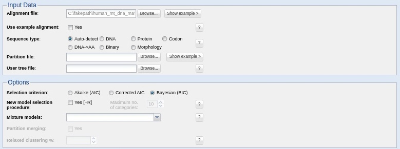
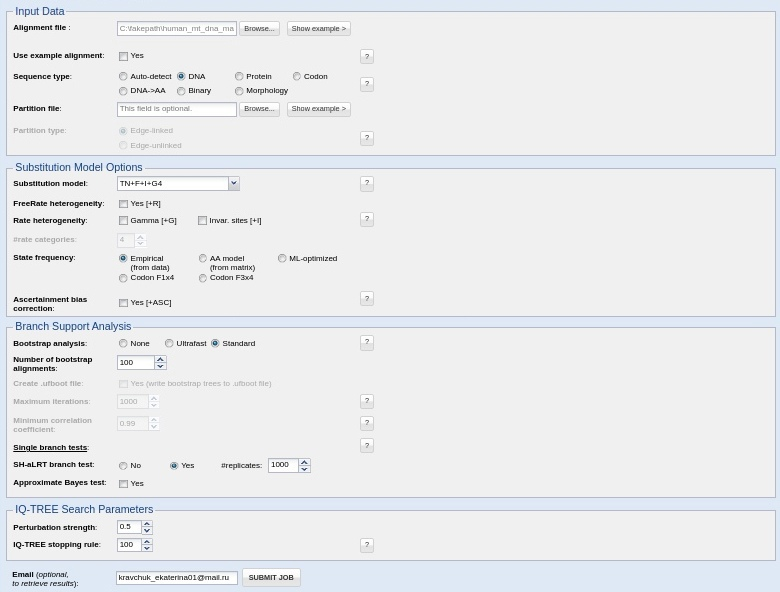
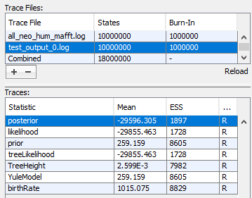
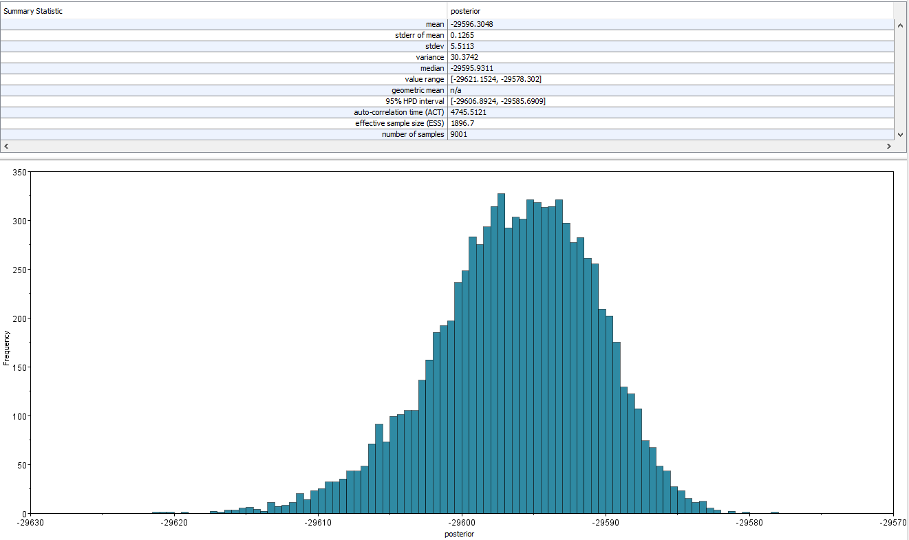
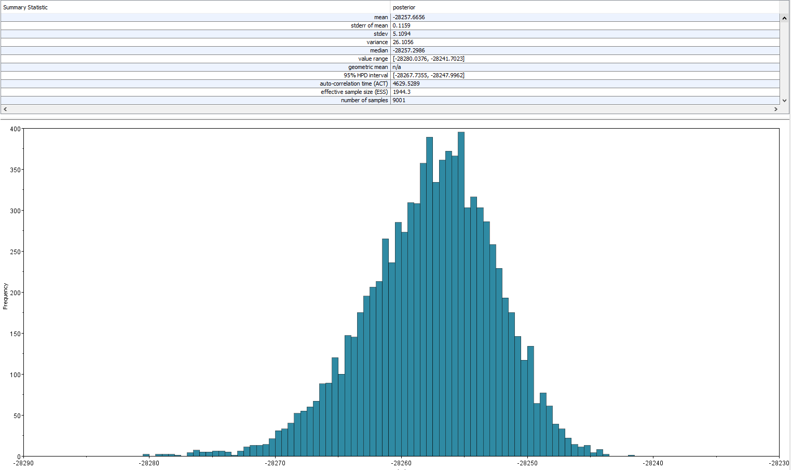
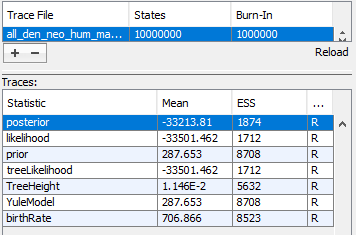
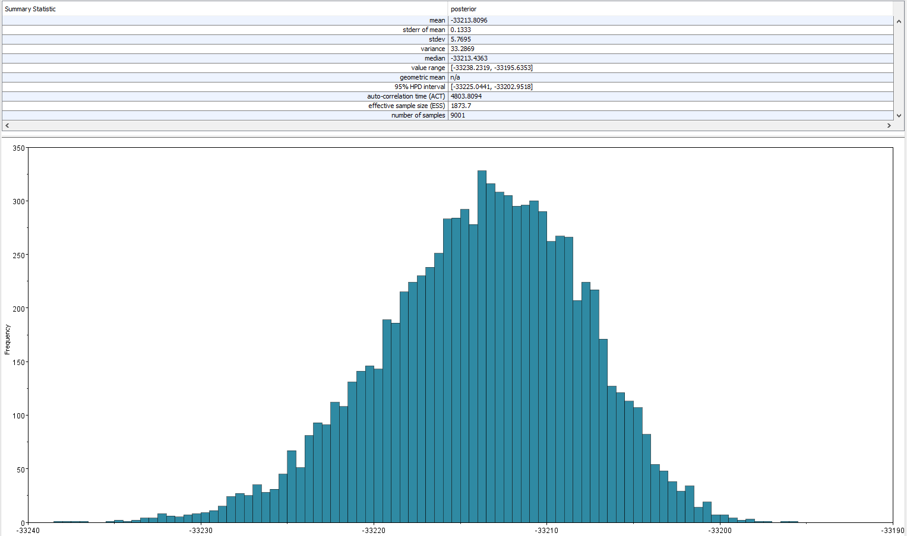
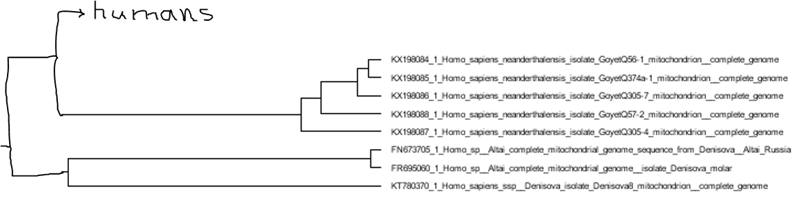

# Human phylogenetics
## 1. Constructing an evolutionary tree based on human mtDNA data
### 1.1. Alignment
I use human mtDNA data ./data/Human.zip. After unzipping I merge the files into one:
```bash 
cat data/Human/* > data/human_mt_dna.fasta
```
Then I perform alignment using MAFFT:
```bash
mafft --auto data/human_mt_dna.fasta >data/human_mt_dna_mafft.fasta
```
### 1.2. Tree reconstruction
Here you can see the alignment in UGENE:<br>

### 1.2. Tree reconstruction
Here I use online version of the IQ-tree software - http://iqtree.cibiv.univie.ac.at/<br>
Model selection: <br>

The output:<br>
Best-fit model: TN+F+I+G4 chosen according to BIC<br>
Tree reconstruction:<br>
<br>
Consensus tree in newick format:<br>
(JQ247408.1:0.0009924917,KX459697.1:0.0003627281,((((((((KP172434.1:0.0011166973,JF499899.1:0.0006170870)91:0.0003086609,KY686210.1:0.0012362367)36:0.0000612195,((((HQ914447.1:0.0007254161,(KX440262.1:0.0009110984,KX440275.1:0.0005085143)96:0.0002392312)99:0.0004429030,(JF837819.1:0.0004304300,(KX440315.1:0.0003055436,JN419195.1:0.0002444220)100:0.0002456414)100:0.0006191842)87:0.0001874856,KY303770.1:0.0010476605)47:0.0000589268,((KT698008.1:0.0007386874,HQ189135.1:0.0004290573)100:0.0005954734,(KT698006.1:0.0014288406,HM804485.1:0.0009039245)50:0.0000975173)57:0.0002028733)15:0.0000028533)23:0.0000028533,(((KY934476.1:0.0004262019,KY077676.1:0.0001866513)77:0.0001217544,KP340170.1:0.0004908250)45:0.0000028533,(JF343123.1:0.0003049970,KY496869.1:0.0004290781)100:0.0003648594)85:0.0001822692)28:0.0000582699,(HQ259121.1:0.0008701611,KU521454.1:0.0009304042)90:0.0003014615)31:0.0000603051,(KU521494.1:0.0000028533,KU521491.1:0.0001213683)100:0.0010443843)28:0.0000608521,((((((KP017255.1:0.0005520973,JF811749.1:0.0007399035)100:0.0006235525,KM986625.1:0.0011726924)67:0.0000581769,((KP172432.1:0.0008007209,JN084079.1:0.0005579138)100:0.0003708258,KY686209.1:0.0008591680)85:0.0000605987)91:0.0002431081,(((FJ713601.1:0.0034849109,(KR135883.1:0.0010653202,KR135861.1:0.0021800358)92:0.0004519900)99:0.0004023352,KM986608.1:0.0013537953)93:0.0001955418,KT819263.1:0.0007357712)68:0.0000581979)89:0.0002450232,((KY348642.1:0.0007998318,(GU590993.1:0.0004273908,KY369152.2:0.0003658921)79:0.0000028533)100:0.0004317376,KM986616.1:0.0008676927)99:0.0004261623)41:0.0000609976,((KU508374.1:0.0003076711,KY934478.1:0.0004292508)100:0.0009359340,(HM453712.1:0.0003709522,HM448049.1:0.0007400365)88:0.0004965969)40:0.0000577838)5:0.0000028533)14:0.0000028533,JN084084.1:0.0009216812)100:0.0006163172);<br>
For tree visualization I used ETE Toolkit Phylogenetic tree (newick) viewer http://etetoolkit.org/treeview/<br>
<br>
## 2. Mitochondrial Eve
I converted the FASTA alignment of Human mitochondrial DNA to the BEAST xml format and analyzed it using BEAST tool. <br>
Then I used Tracer to identify the most recent common ancestor age.<br>
<br>
<br>
As we can see from Tracer calculations, we can date the most recent common ancestor of mitochondria from modern Homo sapiens samples at 29596 years ago.<br>
<br>
Let's find out the age for the most recent ancester for the modern non-African by excluding Africa-related sequences from our list (L1c1d Central African, L2a1a Mozambican, L2e1 Sudanese, L3e5a1 Morocco, L4b2a1 Yemeni):<br>
```bash
cat data/Human_non_African/*.fasta > data/all_modern_nonAf.fa
mafft --auto data/all_modern_nonAf.fa > data/all_modern_nonAf_mafft.fa
```
Next converting the FASTA alignment of non-African mtDNA to the BEAST xml format and analyzing it using BEAST tool.<br>
Using Tracer to identify the age of the most recent common ancestor from non-African mtDNA.<br>
<br>
Looks like the age of the most recent common ancestor of the modern non-Africal human is approximately 28258 years.<br>
Our next goal is to age the most recent common ancestor of modern Homo sapiens and Neanderthals<br>
To do so, we will add Neanderthal mtDNA samples https://figshare.com/ndownloader/files/30768766 to the existing human samples and construct an evolutionary tree for the augmented collection. We will then use the estimated age of mitochondrial Eve to calibrate this tree’s molecular clock and assign a date to the root, which corresponds to the most recent common ancestor of modern humans and Neanderthals.<br>
```bash
cat data/Human/*.fasta > data/all_neo.fa
cat data/all_neo.fa data/human_mt_dna.fasta > data/all_neo_hum.fa
mafft --auto data/all_neo_hum.fa > data/all_neo_hum_mafft.fa
```
BEAST and Tracer results corresponding to the most recent common ancestor of modern humans and Neanderthals:<br>
<br>
<br>
Rooted tree for all Human and Neanderthal samples mtDNA:<br>
<br>
As we can see, Neanderthals are clearly distributed into separate clade and age of the most recent common ancestor is aproximatly 30893 years.
## 3. Common ancestor with Denisovan
I added three Denisovan mtDNA samples https://figshare.com/ndownloader/files/30768775 to the set of Homo sapiens and Neanderthal samples and construct the resulting evolutionary tree to figure out wWhat is the age of the most recent common ancestor.
```bash
cat data/Denisovan/*.fasta > data/all_den.fa
cat data/all_den.fa data/all_neo_hum.fa > data/all_den_neo_hum.fa
mafft --auto data/all_den_neo_hum.fa > data/all_den_neo_hum_mafft.fa
```
Tracer results for Human + Neanderthals + Denisovan:<br>
<br>
<br>
Rooting and visualizing most common ancestor for all modern Human + Neanderthals + Denisova using TreeAnnotator and FigTree tools:<br>
<br>
The age on most recent common ancestor for all modern Humans, Neanderthals and Denisovans is approximately 33214 years.

